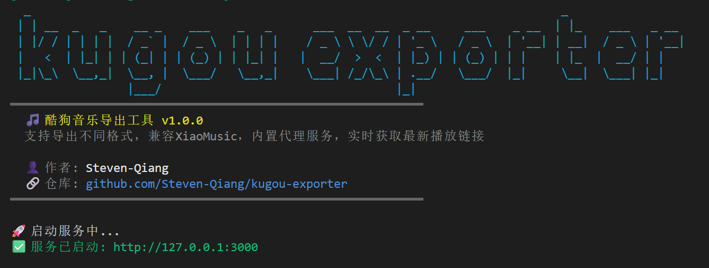
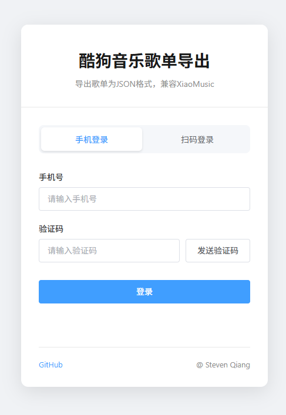
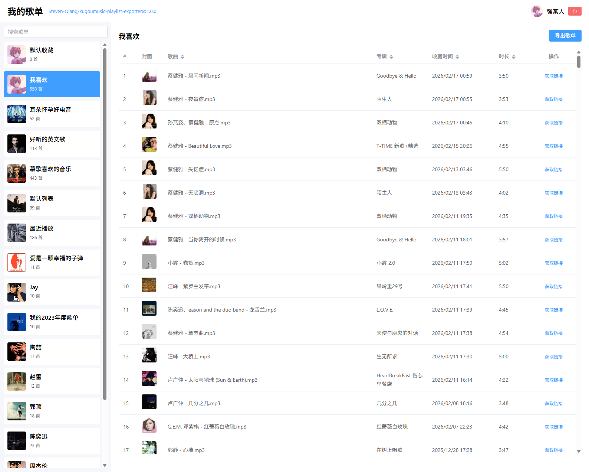
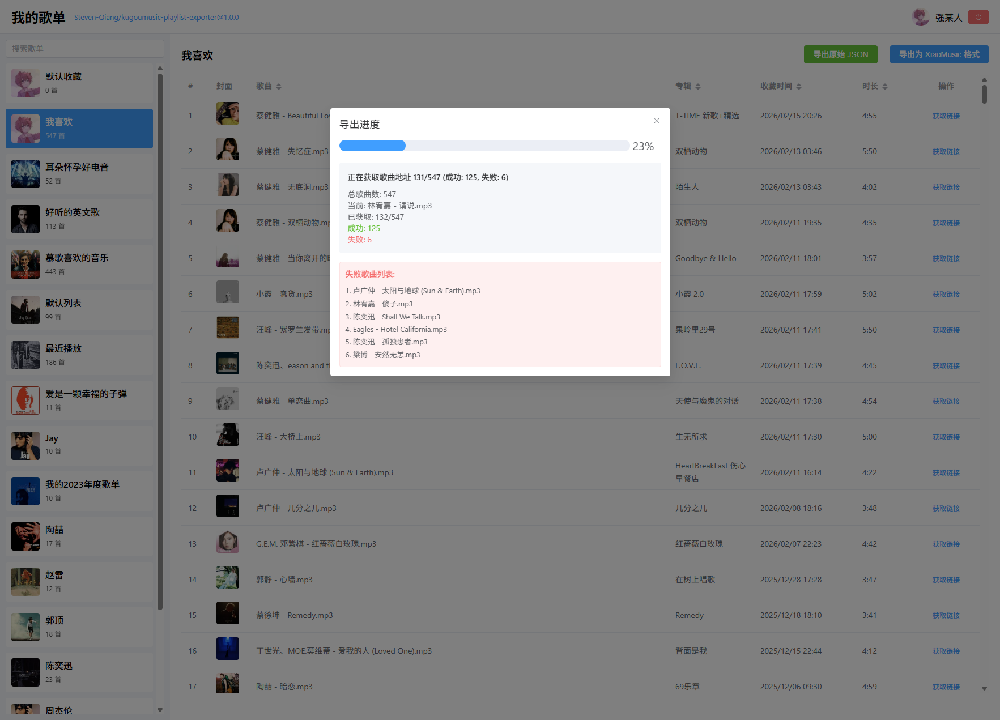
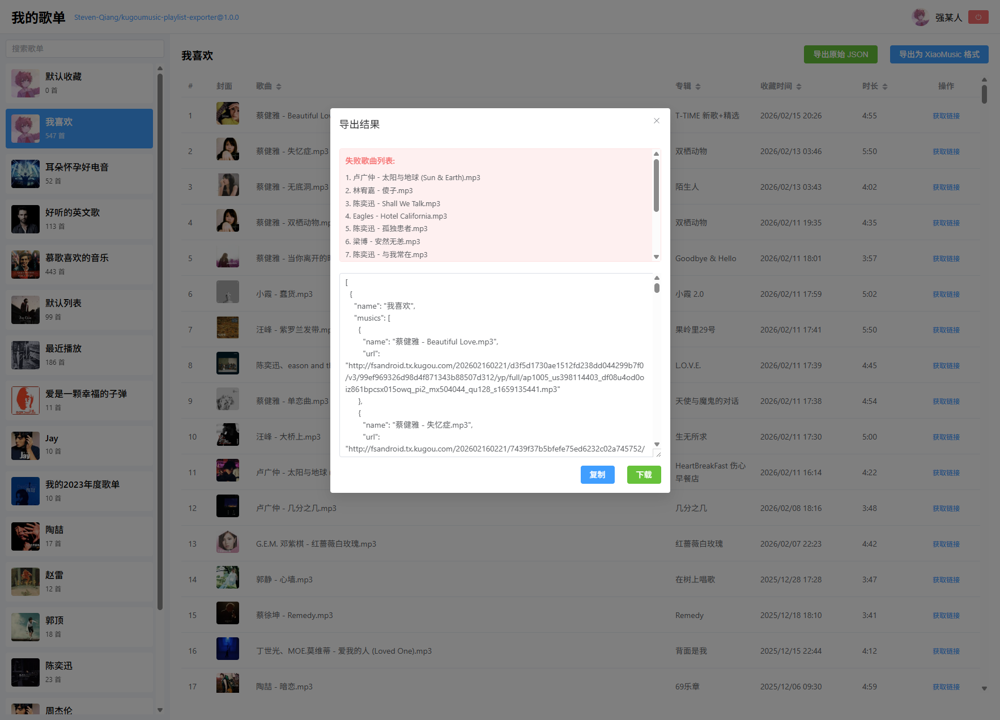
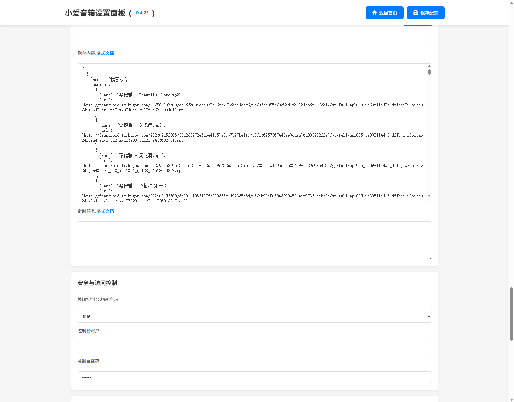
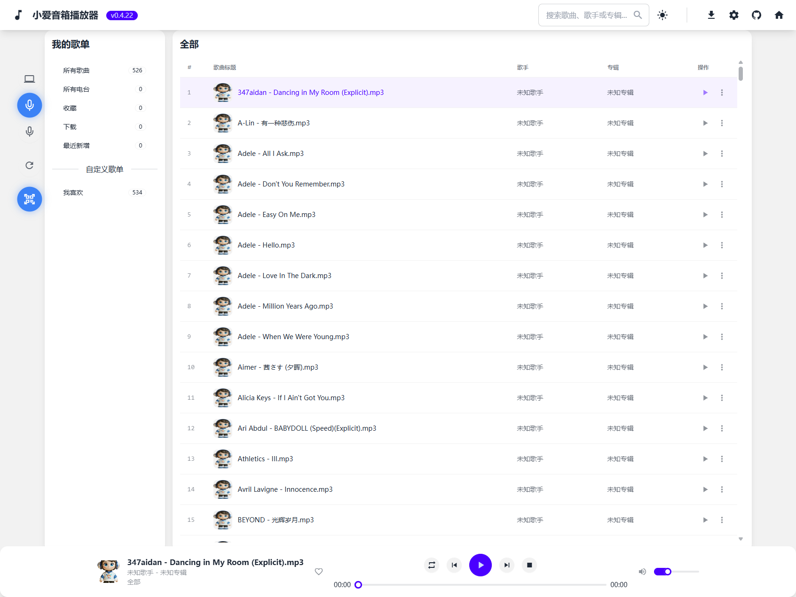

# 酷狗音乐歌单导出工具 


[](https://github.com/Steven-Qiang/kugoumusic-playlist-exporter/stargazers)
[](https://github.com/Steven-Qiang/kugoumusic-playlist-exporter/blob/main/LICENSE)
[](https://github.com/Steven-Qiang/kugoumusic-playlist-exporter/issues)

kugoumusic-playlist-exporter

将酷狗音乐歌单导出为通用JSON格式，兼容 xiaomusic（小爱音箱）等播放器

[功能特性](#功能特性) • [快速开始](#快速开始) • [使用说明](#使用说明) • [开发指南](#开发指南)


---

## 功能特性

- 📱 手机验证码登录
- 📷 二维码扫码登录
- 📋 获取用户歌单列表
- 🔍 查看歌单详情
- 🎼 支持多列排序（歌名、收藏时间、时长）
- 🔗 单曲链接获取（支持多音质）
- 📦 导出为通用 JSON 格式
- 📊 实时进度显示
- ⚠️ 失败歌曲记录

### 导出格式

```json
{
  "name": "歌单名称",
  "musics": [
    {
      "name": "歌名",
      "url": "http://..."
    }
  ]
}
```

---

## 快速开始

### 下载安装

从 [Releases](https://github.com/Steven-Qiang/kugoumusic-playlist-exporter/releases) 页面下载对应平台的可执行文件。

### 运行程序

双击运行下载的可执行文件即可。



服务地址：

- 🌐 API 服务: http://127.0.0.1:3000
- 🎨 Web 界面: http://127.0.0.1:5173

---

## 使用说明

### 1. 登录账号

选择以下任一方式登录：

- **手机验证码**: 输入手机号 → 获取验证码 → 登录
- **扫码登录**: 使用酷狗音乐 App 扫描二维码



### 2. 选择歌单

登录成功后，在歌单列表中选择要导出的歌单。



### 3. 导出歌单

点击「导出歌单」按钮，程序会：

1. 获取完整歌单（分页加载）
2. 注册设备获取播放权限
3. 逐个获取歌曲播放链接
4. 生成 JSON 文件并自动下载





### 4. 查看单曲链接

点击歌曲列表中的「获取链接」按钮，可查看该歌曲的所有可用链接（不同音质），并支持一键复制。

### 5. 导入到 xiaomusic

在 xiaomusic 设置页面，选择导出的 JSON 文件导入即可。





---

## 开发指南

> 仅适用于开发者，普通用户请直接下载 [Release](https://github.com/Steven-Qiang/kugoumusic-playlist-exporter/releases)

### 环境要求

- Node.js >= 18
- pnpm >= 8

### 安装依赖

```bash
pnpm install
```

### 开发模式

```bash
pnpm dev
```

### 构建项目

```bash
pnpm build
```

### 项目结构

```
kugoumusicapi-xiaomusic/
├── apps/
│   ├── launcher/              # Node.js 启动器
│   │   ├── index.js           # 启动服务
│   │   └── package.json
│   │
│   └── web/                   # Vue3 前端
│       ├── src/
│       │   ├── router/        # 路由配置
│       │   ├── types/         # TypeScript 类型
│       │   ├── utils/         # 工具函数
│       │   └── views/         # 页面组件
│       └── vite.config.ts
│
├── scripts/                   # 构建脚本
│   ├── build.js              # 打包脚本
│   └── patch-kugoumusicapi.js # API 补丁
│
└── pnpm-workspace.yaml        # Workspace 配置
```

### 构建说明

1. **前端构建**: Vite 打包 Vue 应用
2. **依赖打包**: ncc 将所有依赖打包成单文件
3. **二进制打包**: nexe 生成可执行文件

---

---

## 许可证

MIT License

---

## 致谢

- [kugoumusicapi](https://github.com/MakcRe/KuGouMusicApi) - KuGouMusicApi
- [xiaomusic](https://github.com/hanxi/xiaomusic) - XiaoMusic

---


**如果这个项目对你有帮助，请给个 ⭐️ Star 支持一下！**


